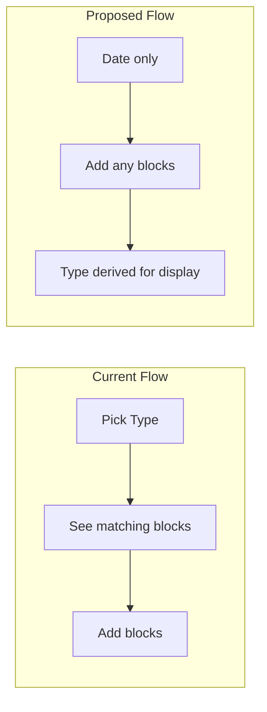

# Block-First Session UX: Remove Explicit Type Selection

## The Problem

Right now, users must pick a session type (Strength / Workout / Mixed) before logging. That choice:

1. **Doesn't match how people think** — Users think "I did squats and a metcon," not "I had a mixed session."
2. **Creates artificial constraints** — Choosing "Strength" hides the Workout section; choosing "Workout" hides Strength. Users can't easily change their mind without re-selecting type.
3. **Won't scale** — Adding warmups, accessories, etc. would require new session types or combinations (strength + warmup + accessory + workout?), leading to combinatorial explosion.
4. **Is redundant** — The session type is fully determined by its blocks. Storing it separately adds friction and potential inconsistency.

## Proposed Model: Block-First Sessions



**Core idea:** A session is a date + an ordered list of blocks. No upfront type selection. Users add blocks; the app infers a display label from what's there.

### Log Page Flow (New)

- **Date** — Required, as today.
- **Blocks** — Single list of addable block types:
  - Add Exercise Block
  - Add Workout Block
  - (Future: Add Warmup, Add Accessory, etc.)
- **No type selector** — All block types are always available. Users add what they did and remove what they didn't.
- **Empty state** — "Add a block to get started" with buttons for each block type.

### Derived Display Label

When showing a session (dashboard, calendar, history), compute a label from its blocks:

| Blocks present             | Display label             |
| -------------------------- | ------------------------- |
| Exercises only             | Exercise                  |
| Workouts only              | Workout                   |
| Both                       | Exercise + Workout        |
| (Future) Warmup + Strength | Warmup + Strength         |
| etc.                       | Composed from block types |

This keeps the same visual language (icons, labels) without requiring user input.

## Implementation Scope

### 1. Schema and Data

- **Migration:** Remove `type` from `sessions`. The column can be dropped in a migration.
- **createSession:** Accept only `{ date }`. No `type` parameter.
- **Types:** Remove `SessionType` from `Session` interface; add a helper like `deriveSessionLabel(session: SessionWithBlocks): string` for display.

### 2. Log Page ([app/log/page.tsx](app/log/page.tsx))

- Remove the Type `Select` and `type` state.
- Remove `showStrength` / `showWorkout` — always show both block sections (or a unified "Add block" flow).
- Two options for layout:
  - **A) Keep separate sections** — Strength and Workout sections always visible; users add blocks to each. Simpler change.
  - **B) Unified block list** — Single list of blocks (Strength, Workout, Warm-up, etc.) with "Add block" dropdown. More flexible for future block types.

Recommendation: Start with **A** for minimal change; refactor to **B** when adding warm-up/accessory blocks.

### 3. Display Surfaces

- **Dashboard** ([app/page.tsx](app/page.tsx)) — Use `deriveSessionLabel(session)` instead of `SESSION_TYPE_LABELS[session.type]`.
- **Calendar** ([app/calendar/page.tsx](app/calendar/page.tsx)) — Same: derive label from `session.exercises` and `session.workouts`.

### 4. Helper Function

```ts
function deriveSessionLabel(session: SessionWithBlocks): string {
  const hasStrength = (session.exercises?.length ?? 0) > 0;
  const hasWorkout = (session.workouts?.length ?? 0) > 0;
  if (hasStrength && hasWorkout) return "Strength + Workout";
  if (hasWorkout) return "Workout";
  if (hasStrength) return "Strength";
  return "Session"; // fallback for empty (shouldn't happen in practice)
}
```

Icons can be chosen by the same logic (e.g. mixed icon when both, otherwise strength or workout icon).

## Future: Warm-ups and Accessories

With a block-first model:

- Add `warmup_blocks` (or a generic `blocks` table with `block_type`) to the schema.
- Add "Add Warm-up" and "Add Accessory" to the log UI.
- Extend `deriveSessionLabel` to include those block types in the label (e.g. "Warm-up + Strength + Workout").
- No new session types; only new block types.

## Summary

| Aspect        | Before                            | After                       |
| ------------- | --------------------------------- | --------------------------- |
| User action   | Pick type, then add blocks        | Add blocks only             |
| Session type  | Stored, user-chosen               | Derived from blocks         |
| Extensibility | New session types per combination | New block types only        |
| Consistency   | Type can mismatch blocks          | Type always matches content |

This aligns the model with how users think and prepares the app for warm-ups, accessories, and other block types without redesigning the session concept.
