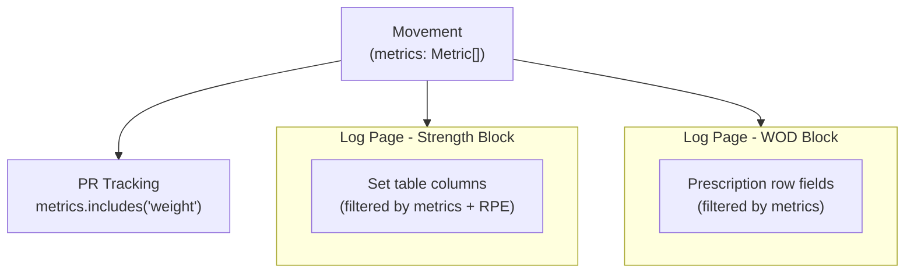

# Movement-Aware Metrics

## Problem

Every strength exercise today renders the same 5 columns: `#`, `kg`, `Reps`, `Secs`, `RPE`. There is no concept of a movement having a measurement profile — a "Run" incorrectly shows reps and weight fields.

## Core Concept: `Metric`

A new Postgres enum type and TypeScript union that represents what a movement measures:

```typescript
type Metric = "reps" | "weight" | "duration" | "distance" | "calories";
```

Each `Movement` gets a `metrics: Metric[]` column. This is the single source of truth for what fields appear in:

- Set logging columns (log page strength block)
- WOD prescription fields (workout_movements row)
- PR tracking eligibility

`effort` (RPE) is **not** a metric. It is a universal optional qualifier always shown alongside any metrics, always last.

---

## Key Decisions

- `metrics` is an array (not boolean flags, not a compound enum) — clean, composable, queryable via `WHERE 'weight' = ANY(metrics)`
- Measurement is independent of `type` (strength/skill/conditioning) — those are separate concerns
- No default metrics when creating a movement — each movement is configured explicitly
- At least one metric required (app-level validation, no DB constraint)
- RPE always available as an optional field, never part of `metrics`
- PRs remain weight-only: `metrics.includes('weight')` replaces `type === 'strength'`
- Duration PRs deferred (direction ambiguity: plank = higher better, run = lower better)

---

## Schema Changes

### New Postgres enum

```sql
CREATE TYPE metric AS ENUM ('reps', 'weight', 'duration', 'distance', 'calories');
```

### `[supabase/migrations/](supabase/migrations/)` — new migration file

| Table               | Column     | Type                             | Notes        |
| ------------------- | ---------- | -------------------------------- | ------------ |
| `movements`         | `metrics`  | `metric[] NOT NULL DEFAULT '{}'` | new          |
| `sets`              | `distance` | `numeric(8,2) NULL`              | new          |
| `sets`              | `calories` | `numeric(6,2) NULL`              | new          |
| `workout_movements` | `duration` | `integer NULL`                   | seconds; new |
| `workout_movements` | `calories` | `numeric(6,2) NULL`              | new          |

### Existing movement backfill

Existing movements get `metrics` backfilled by logical evaluation of the movement name (not a blanket type-based mapping). E.g. "Run" → `['distance', 'duration']`, "Deadlift" → `['reps', 'weight']`, "Plank" → `['duration']`.

---

## TypeScript Type Changes

`[types/database.ts](types/database.ts)`

```typescript
export type Metric = "reps" | "weight" | "duration" | "distance" | "calories";

export interface Movement {
  // existing fields...
  metrics: Metric[];
}

export interface Set {
  // existing fields...
  distance: number | null; // new
  calories: number | null; // new
}

export interface WorkoutMovement {
  // existing fields...
  duration: number | null; // new (seconds)
  calories: number | null; // new
}
```

---

## Column Rendering: Canonical Order

Columns render in fixed order, filtered to only the metrics the movement declares:

```
Reps → Weight (kg) → Distance (m) → Calories → Duration (secs) → RPE
```

RPE always appears last, always optional, regardless of metrics.

---

## Data Flow



---

## Movement Creation Flow

Built inline within the existing `[components/movement-picker.tsx](components/movement-picker.tsx)` dialog. No new route or stacked modal.

Flow:

1. User opens movement picker (mid-logging, movement not found)
2. Taps "Create movement" at bottom of picker
3. Dialog content swaps in place to a creation form
4. Form fields: `name`, `type`, `area`, `metrics` (multi-select)
5. On save: `custom: true` set automatically, new movement auto-selected, dialog closes
6. Log page receives the new movement and renders correct columns immediately

UX constraint: form must feel minimal and unintimidating — avoid overwhelming the user with too many simultaneous decisions.

---

## Files Affected

| File                                                               | Change                                                         |
| ------------------------------------------------------------------ | -------------------------------------------------------------- |
| `supabase/migrations/`                                             | New migration: enum, columns, backfill                         |
| `[types/database.ts](types/database.ts)`                           | Add `Metric` type; update `Movement`, `Set`, `WorkoutMovement` |
| `[lib/queries.ts](lib/queries.ts)`                                 | Update `upsertSet`, `getTopPRs` (weight check), `getMovements` |
| `[components/movement-picker.tsx](components/movement-picker.tsx)` | Add inline creation form flow                                  |
| `[app/log/page.tsx](app/log/page.tsx)`                             | Dynamic set columns; dynamic WOD prescription fields           |
| `[app/movements/[id]/page.tsx](app/movements/[id]/page.tsx)`       | Display metrics; update history table columns                  |
| `[app/page.tsx](app/page.tsx)`                                     | Update PR query usage                                          |

---

## Out of Scope

- Duration PRs (deferred — directional ambiguity)
- `/movements/new` dedicated route
- Metric reordering per movement
- PR tracking for distance or reps
